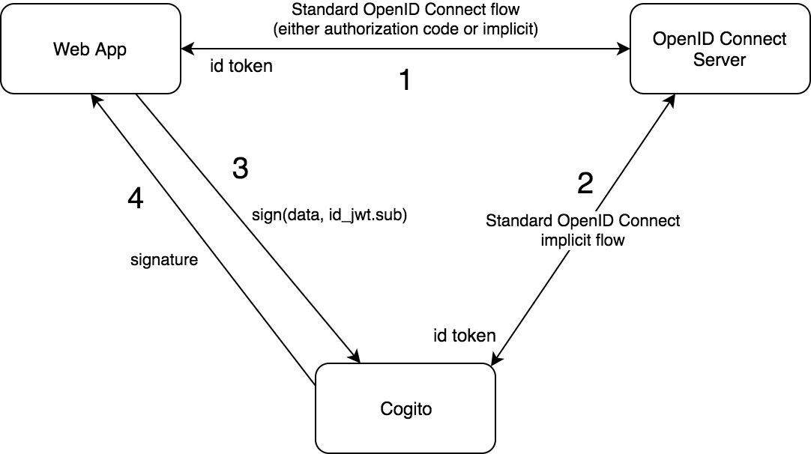
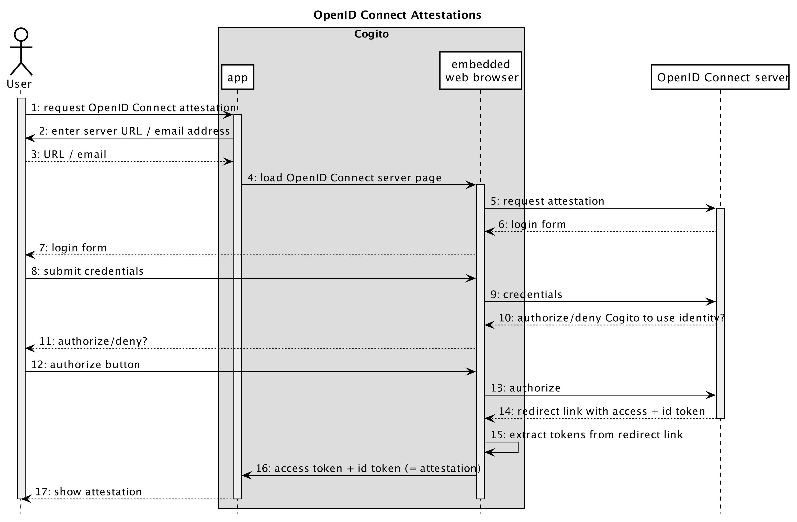

---
title: Cogito Architecture
date: October 3, 2017
author:
- Stefan van den Oord
- Mark Spanbroek
paper-size: a4
documentclass: article
geometry: a4paper,includeheadfoot,margin=2.54cm
abstract:
  "_Cogito_ is a self-sovereign identity management app. It manages your digital
  identity, consisting of cryptographic key pairs for signing/verifying and
  encrypting/decrypting data, as well as attestations: claims about your
  identity. This document describes the architecture of systems that use
  _Cogito_. Specifically, it explains how identity information from OpenID
  Connect systems can be integrated in a _Cogito_ identity. This way users can
  sign using a self-sovereign identity, which is provably backed by an
  identity from a third-party OpenID Connect server. Typical use cases are
  systems where users need to sign blockchain transactions using a corporate
  identity from an OpenID Connect server."
---

Use Case: Signing Data with OpenID Connect-backed Identity
----------------------------------------------------------
Cogito can sign data on behalf of a (web) app, while giving the
guarantee that the signing identity is authenticated by an OpenID
Connect server. The diagram "Signing data with Cogito" provides a
high-level overview of the interactions that are relevant for this
use case.

1. As usual in such settings, the web app authenticates the user
   with the OpenID Connect Server, either using the [OpenID Connect
   Authorization Code Flow][OpenIDAuthCode], or using the [Implicit
   Flow][OIDCImplicit]. When successful, the web app obtains an
   access token and an identity token. The identity token is a
   [JWT][JWT] that contains a `sub` field: the identifier of the
   authenticated user in the OpenID Connect server.
2. The user wants to sign data using their Cogito identity. So
   the web app refers the user to Cogito, using a QR code to setup
   a secure communication channel between the web app and Cogito.
   The secure channel is built using [Telepath][Telepath]. Cogito
   requires both the data to be signed, as well as the `sub` field
   from the user's identity token.
3. Cogito now starts a standard [OpenID Connect Implicit
   Flow][OIDCImplicit] to establish that the user is authenticated
   with the OpenID Connect server. When successful, Cogito receives
   an identity token from the OpenID Connect server. Cogito ensures
   that the identity has the same `sub` value as the one received
   in the signing request.
4. Now that the user is authenticated with Cogito and the `sub`
   is verified, Cogito signs the data using the keys it has for the
   identity, and returns the signature to the web app through
   Telepath.

The third step above, the authentication between Cogito and the
OpenID Connect server, is done only once. We refer to this as an
_attestation_: the OpenID Connect server gives the user's identity
an attestation that it is a valid user in the OpenID Connect server.
The section "Attestation from OpenID Connect Server" provides
more detail about this step.

Attestations
------------

### Attestation from OpenID Connect Server

One type of attestation that users can have for their identity, is an
attestation from an OpenID Connect Server. The most obvious use case for this
is that a user gets an attestation from their company. In other words: the
company signs a claim that indeed the user is an employee of the company.

This attestation can be added to the user's identity using the standard
[OpenID Connect _implicit flow_][OIDCImplicit]. The diagram "OpenID Connect Attestations"
illustrates this.

These are the steps displayed in the sequence diagram:

1. Inside the Cogito app, the user indicates that she wants to receive
   an attestation from an OpenID Connect server.
2. Cogito asks the user to identify which OpenID Connect server is to be used.
3. The user provides server URL or email address; in the case of an email
   address, it is converted to an OIDC Connect server URL by the app.
4. Cogito tells the embedded web browser to load the OpenID Connect server
   URL.
5. Here the standard OpenID Connect _implicit flow_ starts. The browser sends
   the OpenID Connect authentication request.
6. The OpenID Connect server responds with an HTML login form.
7. The form is displayed to the user.
8. The user submits the form with their credentials.
9. The credentials are sent to the OpenID Connect server.
10. The OpenID Connect server verifies the credentials, and if OK responds with
    an HTML page asking the user to allow Cogito to user their OpenID Connect
    identity.
11. The page is displayed to the user.
12. The user reviews the information and clicks the 'authorize' button.
13. The browser forwards to the OpenID Connect server.
14. The OpenID Connect server redirects the browser to the URL specified in
    step (5), passing the access token and id token in the URL fragment.
15. The browser extracts the tokens from the URL fragment...
16. ... and sends them to the app.

### TODO: Other Attestation Types

[OIDCImplicit]: https://openid.net/specs/openid-connect-core-1_0.html#ImplicitFlowAuth
[OpenIDAuthCode]: https://openid.net/specs/openid-connect-core-1_0.html#CodeFlowAuth
[JWT]: https://jwt.io
[Telepath]: TODO
