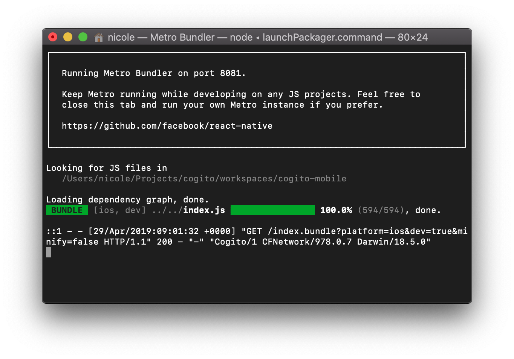
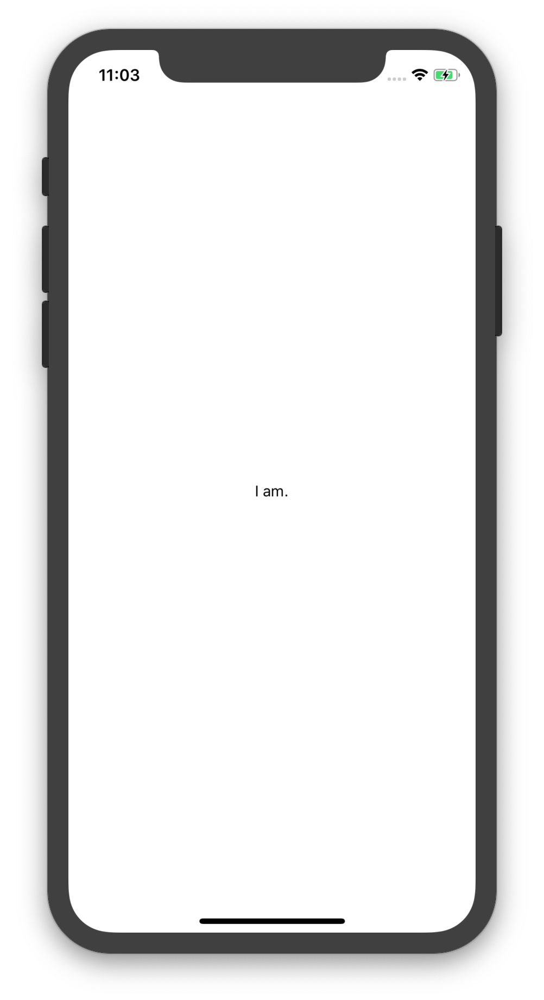
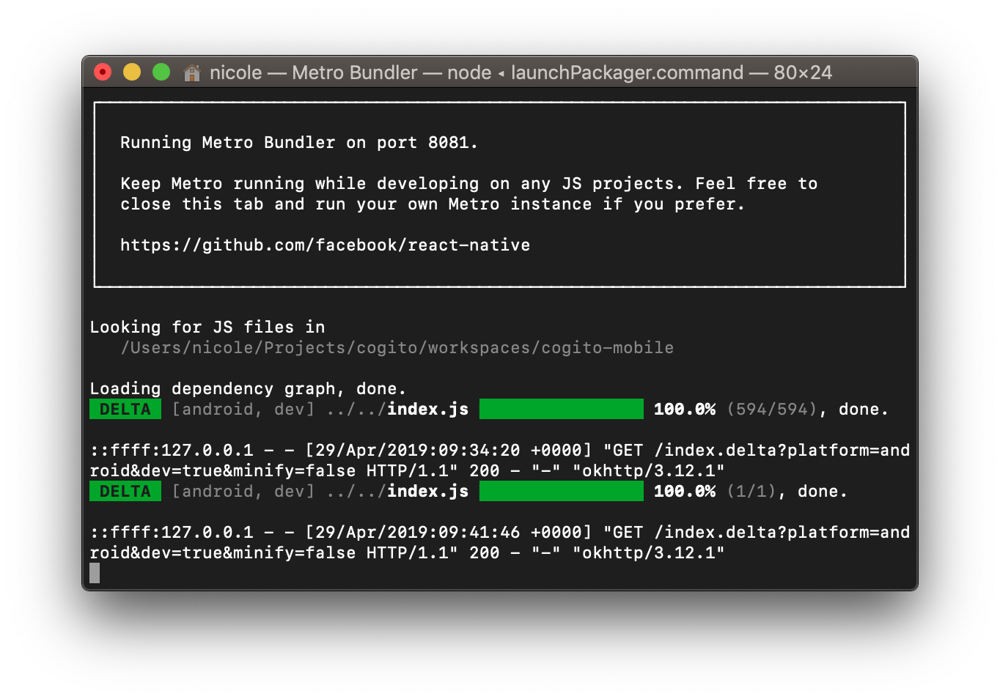
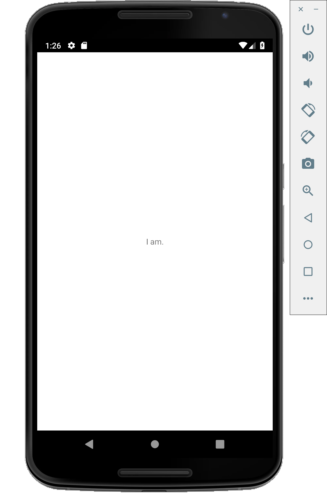

Cogito
======

[Cogito] is an identity management app. This is a rewrite of the iOS only app.
It is meant to replace the iOS app in the future, but is not ready yet.

⚠️ *For now, please use the iOS only app from the cogito-ios-app directory!* ⚠️

## Development

You'll need a working NodeJS environment in addition to iOS and Android
development environments.

For NodeJS, you'll need to install the latest [NodeJS
version](https://nodejs.org) and [Yarn](https://yarnpkg.org), for instance via
Homebrew:

```bash
brew install node
brew install yarn
```

We use TDD and Clean Code principles in our project. To run the tests:

```bash
yarn
yarn test
```

Or: `yarn test --watch` for running the tests continuously.

To run the Cogito Mobile app in the iOS simulator or Android emulator you need
to install the following tools.

### iOS

Install the latest Xcode from the app store. Start it once and accept the terms
and conditions.

Start the iOS app in the simulator using:

```bash
yarn ios
```

It should start a terminal window with Metro and the iOS simulator that looks
like this.




## Android

In order to run Cogito Mobile on Android you need to install the following
tools.

### Java 8

It's easiest to install Java 8 using Homebrew with the following commands:

```bash
brew tap caskroom/versions
brew cask install java8
```

If you have multiple versions of Java make sure you point to the Java 8 version
when using the Android tools.

### Android Studio

Install and run the latest version of
[Android Studio](https://developer.android.com/studio//).

Install the Android SDK version 9.0, API 28 in the SDK Manager.

When needed accept the terms and conditions.

Ensure that the following directories are in your PATH:

```bash
$ANDROID_HOME/emulator
$ANDROID_HOME/tools
$ANDROID_HOME/tools/bin
$ANDROID_HOME/platform-tools
```

### AVD Manager

Using the AVD Manager, install an emulator on which to run the Android app, e.g.
the Nexus 6.

### Running

To start the Android app in the emulator, you first need to ensure that the
emulator is running. You can either start it from the AVD manager, or use the
command line:

```bash
emulator -list-avds
emulator -avd <NAME OF AVD>
```

Unlike iOS, the emulator doesn't start automagically.

Now we can run the Android app:

```bash
yarn android
```

This should start a terminal window with Metro and the Android emulator that
looks like this.




[Cogito]: https://cogito.mobi
