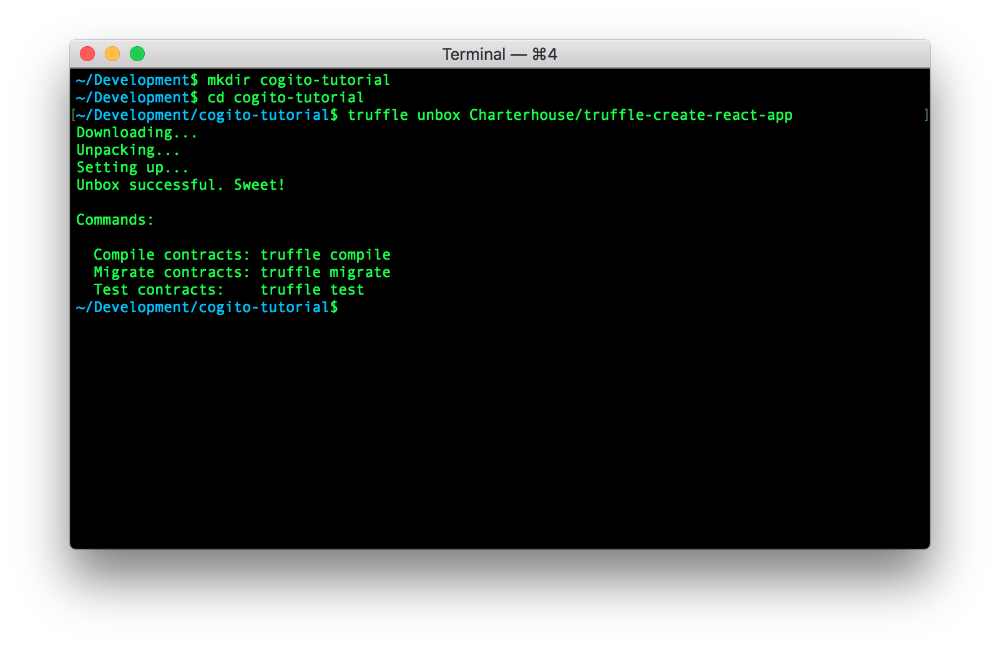
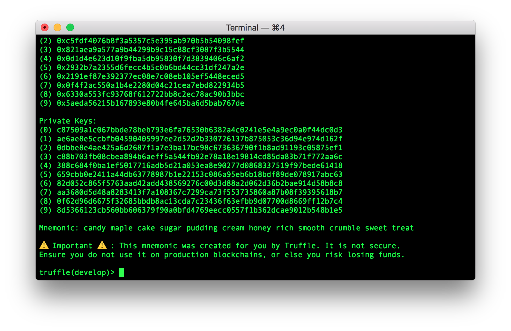
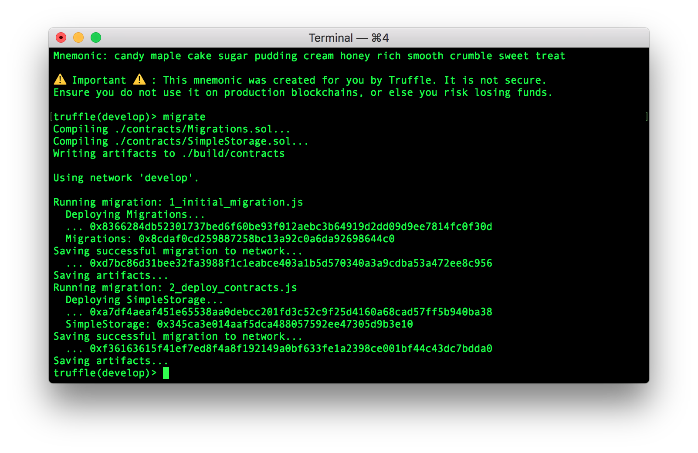
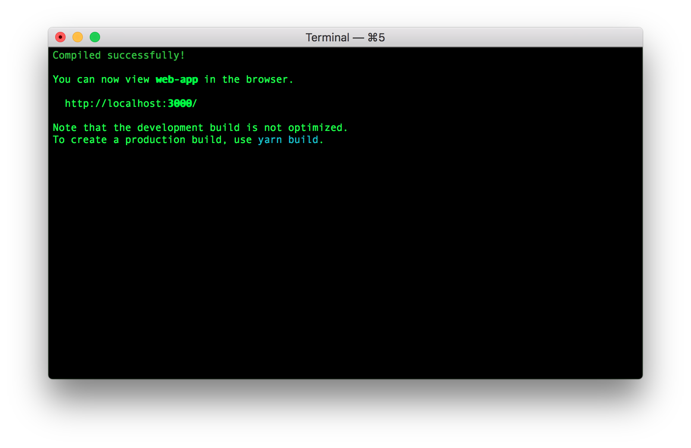
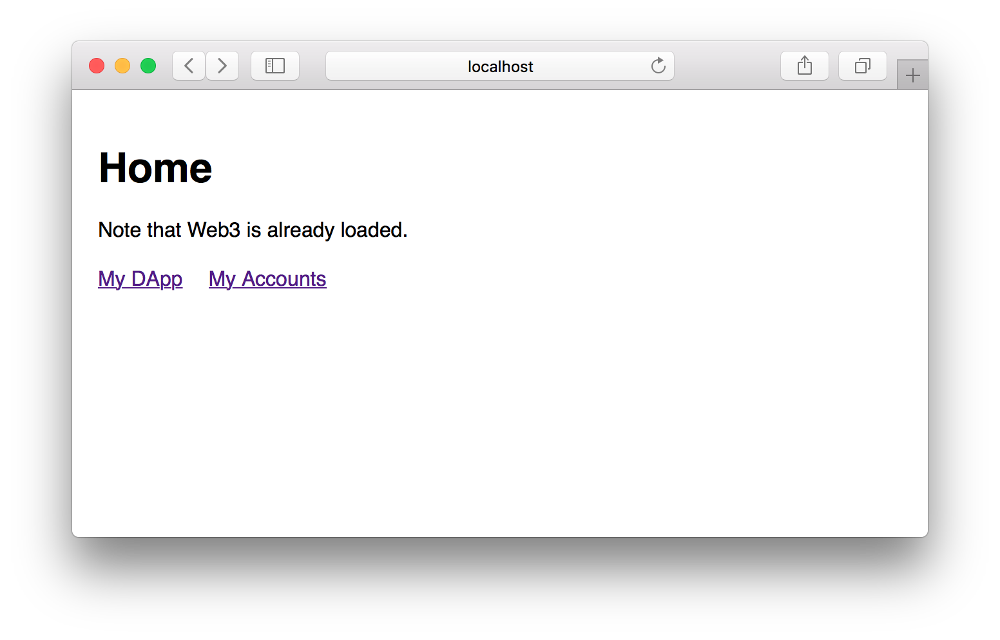
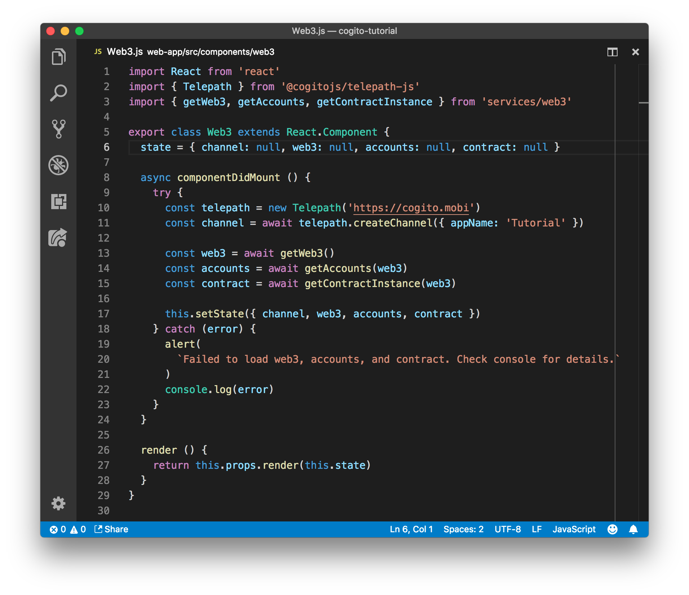

This tutorial teaches you how to add simple and safe signing of Ethereum
transactions to your web app. We will assume basic knowledge of [Node.js][1]
and the [Truffle][2] development environment for Ethereum.

Project setup
-------------

Please ensure that you have a working [Node.js][1] environment and that you
installed [Truffle][2]. We will use the [Yarn][4] package manager instead of the
standard Node package manager, so you might want to install that as well.

We will setup our project using the [Truffle Create React App][3] box,
which will give us a React web app with support for Solidity smart contracts:

    mkdir cogito-tutorial
    cd cogito-tutorial
    truffle unbox Charterhouse/truffle-create-react-app

After issuing these commands your terminal should resemble:



Running the web app
-------------------

You can now start an Ethereum test environment by opening the Truffle
development console:

    truffle develop

Which should give you a prompt like this:



Our project includes an example smart contract in `contracts/SimpleStorage.sol`.
Deploy this smart contract now by executing the following command in the
Truffle development console:

    migrate



Now that we have our Ethereum test environment with smart contracts setup, we
can start a local server to test our web app. In a separate terminal issue the
following commands:

    cd web-app
    yarn start



You should now be able to browse to http://localhost:3000, and see the webapp in
action.



When you play around with the web app you'll notice that you can interact with
the smart contract without having to sign any transactions. This happens because
we are currently using a dummy account that is provided by the Truffle
development environment. In the next section we will add proper transaction
signing using the Cogito app.

Cogito integration
------------------

To enable signing with the Cogito app, we'll go through these steps:

1. Create a Telepath channel for communication between the web app and the
   Cogito mobile app.
2. Display a QR code that allows the mobile app to connect.
3. Replace the standard Ethereum Web3 provider with a Cogito specific version.

### Create Telepath channel

The web app and the Cogito mobile app communicate with each other through an
encrypted channel called Telepath. We start by adding the Telepath package to
our project:

    cd web-app
    yarn add @cogitojs/telepath-js libsodium-wrappers

This add the Telepath package and its dependencies to the web app.

We are now ready to dive into the code of the web app. Start by editing the
component that is responsible for loading the Ethereum Web3 provider. It is
located in the `web-app/src/component/web3/Web3.js` file. Import the Telepath
module by adding the following line to the imports:

```javascript
import { Telepath } from '@cogitojs/telepath-js'
```

Now take a look at the following code in the `componentDidMount` function:

```javascript
const web3 = await getWeb3()
const accounts = await getAccounts(web3)
const contract = await getContractInstance(web3)
this.setState({ web3, accounts, contract })
```

This code first loads the Ethereum web3 provider and then uses it to load the
Ethereum accounts and the smart contract that this web app interacts with. We
are going to expand this code to create the Telepath channel as well. Change the
code to read:

```javascript
const telepath = new Telepath('https://telepath.cogito.mobi')
const channel = await telepath.createChannel({ appName: 'Tutorial' })
this.setState({ channel })

const web3 = await getWeb3()
const accounts = await getAccounts(web3)
const contract = await getContractInstance(web3)
this.setState({ web3, accounts, contract })
```

Notice how this code creates a new instance of Telepath, then creates a new
channel using the app name 'Tutorial', and finally adds the channel to the
state.

Finish up by declaring the `channel` property in the default state. Modify the
first line of the class as follows:

```javascript
state = { channel: null, web3: null, accounts: null, contract: null }
```

The code should now look like this:



### Display QR Code

Now that we created a Telepath channel, we are going to ensure that the Cogito
mobile app can connect to it. We are going to show a QR code that contains the
connection details. We'll need a module for displaying QR codes. You can
install it using:

    cd web-app
    yarn add qrcode.react

We can now open the `web-app/src/App.js` file and add the import for the module:

```javascript
import QRCode from 'qrcode.react'
```

Now we turn to the code that is displayed when loading web3:

```javascript
} else {
  return <p>Loading web3, accounts, and contract.</p>
}
```

We are going to change this code so that it displays the QRCode:

```javascript
} else if (web3Props.channel) {
  const { channel } = web3Props
  const connectUrl = channel.createConnectUrl('https://cogito.mobi')
  return (
    <div>
      <p>Loading web3, accounts, and contract.</p>
      <QRCode value={connectUrl} style={{ margin: '1em' }} />
      <p>Please scan the QR Code with the Cogito mobile app.</p>
    </div>
  )
} else {
  return <p>Creating Telepath Channel..</p>
}
```

The code now checks whether the Telepath channel has been created yet. When it's
been created we ask the channel to create a connection URL, which we then pass
on the QRCode component. We used `https://cogito.mobi` as the base url for the
connection URL. This ensures that scanning the QRCode on your mobile device will
take you to the Cogito mobile app when it's installed.

### Use Cogito-web3

TODO

[1]: https://nodejs.org
[2]: http://truffleframework.com
[3]: http://truffleframework.com/boxes/truffle-create-react-app
[4]: https://yarnpkg.com
