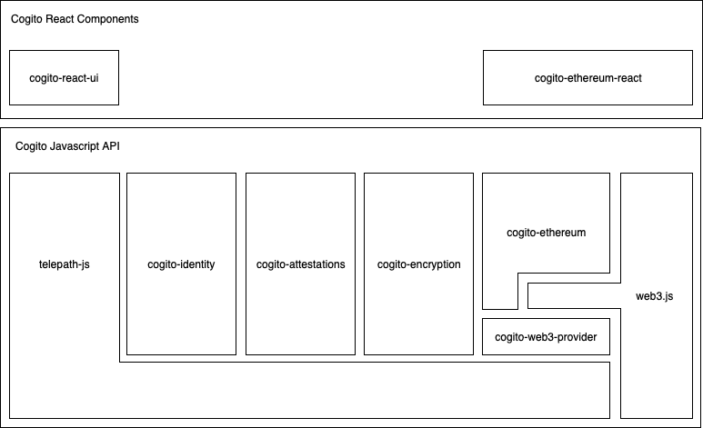
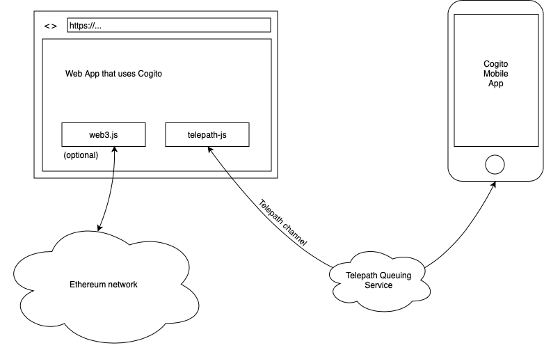
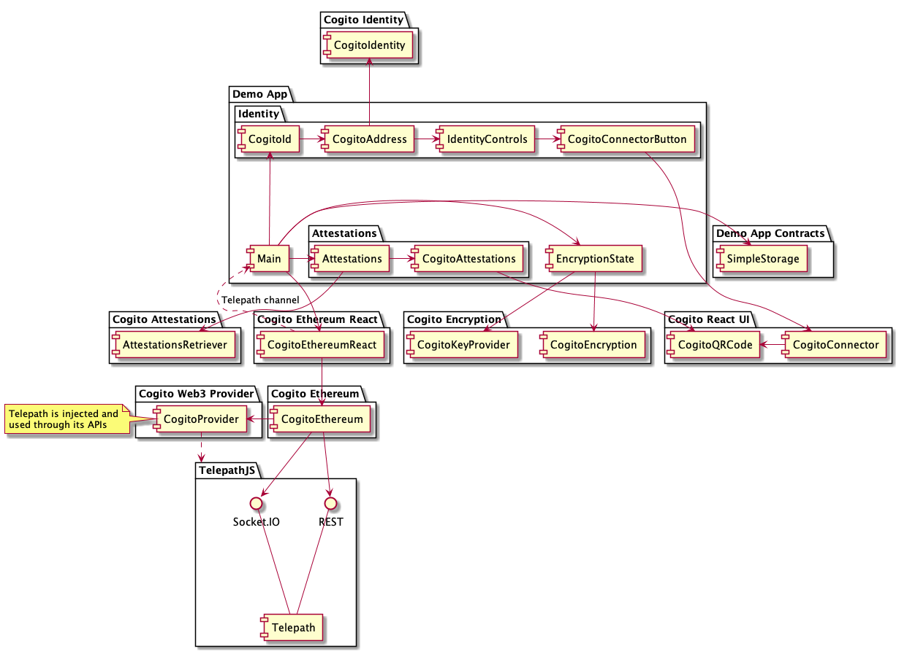

⚠ Deprecation ⚠
----------------

We've learned a lot from creating Cogito, and decided to apply our learnings in
a new project called [Identity Box](https://idbox.online/). Since we're only a
small team, that unfortunately means that we won't be updating Cogito for the
foreseeable future. Should you be in need of updates to Cogito, feel free to
reach out to us on [Slack](https://philips-software-slackin.now.sh), and we'll
see what we can do to help you out.

Introduction
------------

Cogito is an open-source identity management system. For a quick introduction,
visit [cogito.mobi] or watch an [introduction video][fosdem]. You may want to start by
following the [Tutorial](/developer-documentation/tutorial) or by browsing
through the rest of this documentation.

Use cases
---------

#### Identity
Use Cogito to identify the users on your website. Each user presents its own
unique identifier, without the need for a username & password combo. Cogito
identities are backed by a cryptographic private-public keypair. The private
keys remain safely on the phones of your users.

#### Encryption
Enable end-to-end encryption between the user of your website without having to
worry about key management. The private keys are safely stored on the phones of
your users.

#### Blockchain transactions
Allow your users to interact with smart contracts on an Ethereum blockchain. The
cryptographic signatures that are required are generated by Cogito.

API
---

The Javascript API allows webapps to identify Cogito users, provide end-to-end
encryption using Cogito managed keys, and interact with Ethereum smart
contracts.

We also provide convenience components for React based web apps.

More information about the individual components can be found in the Components section of the documentation.

Deployment overview
-------------------

Web apps communicate with the Cogito mobile app through an end-to-end encrypted
communication channel called Telepath. Web apps can also choose to interact with
Ethereum contracts using the well-known
[web3.js](https://github.com/ethereum/web3.js/) api.

The following overview illustrates how Telepath is used throughout all the
packages and the demo app.

Development
-----------

Cogito is still very much a work in progress. If you'd like to contribute, then
you're more than welcome to. Our source code lives on
[GitHub](https://github.com/philips-software/cogito). We wrote
[a guide](https://github.com/philips-software/cogito/blob/master/Contributing.md)
to help you get started on your first contribution.

Community
---------

If you need any help, feel free to reach out on the #cogito channel on
[Slack](https://philips-software-slackin.now.sh/).

[cogito.mobi]: https://cogito.mobi
[fosdem]: https://video.fosdem.org/2019/H.2215/cogito_identity.mp4
